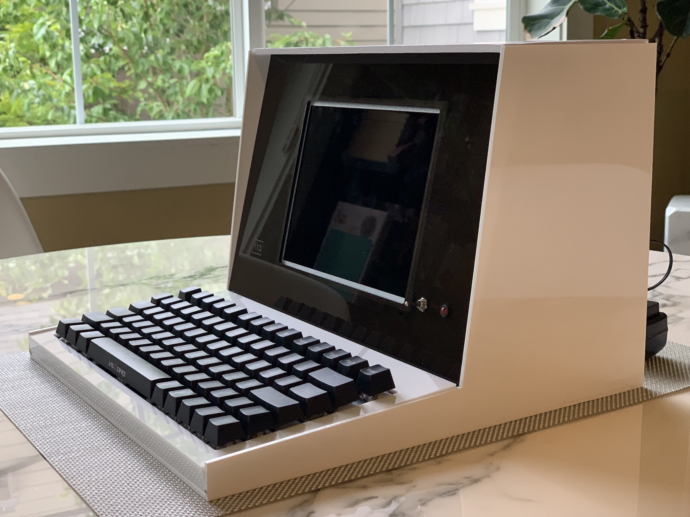
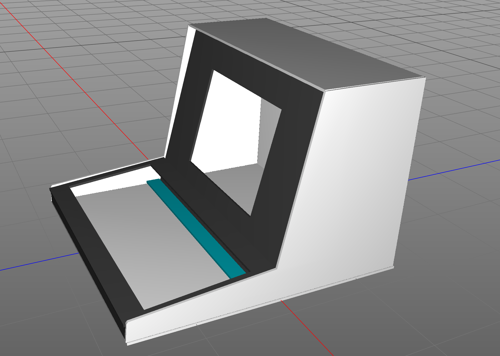
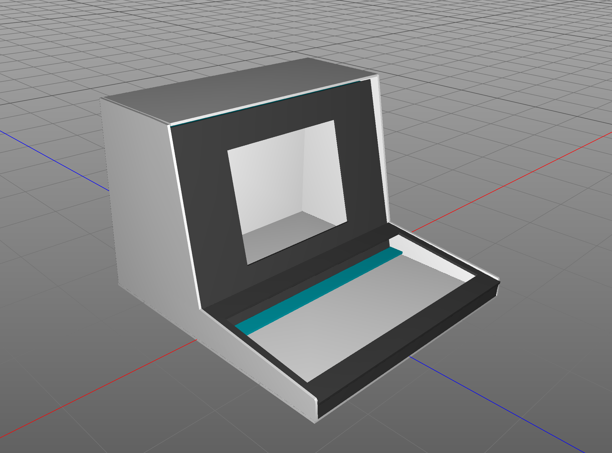
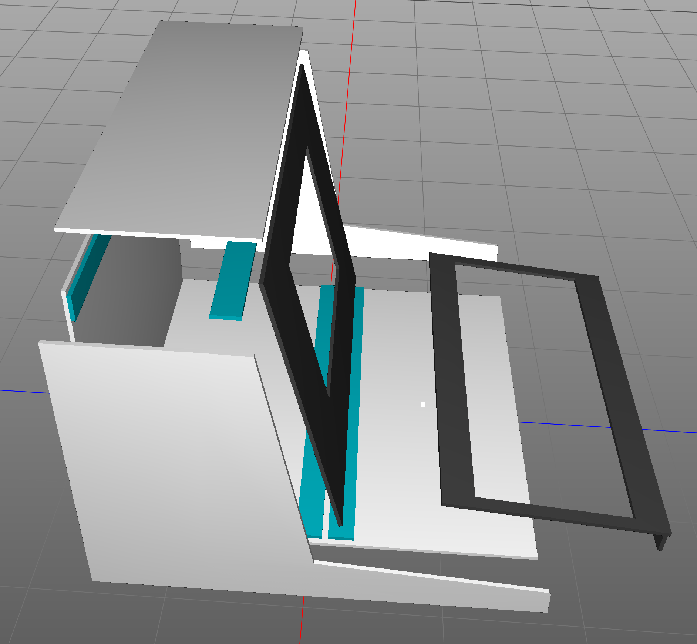
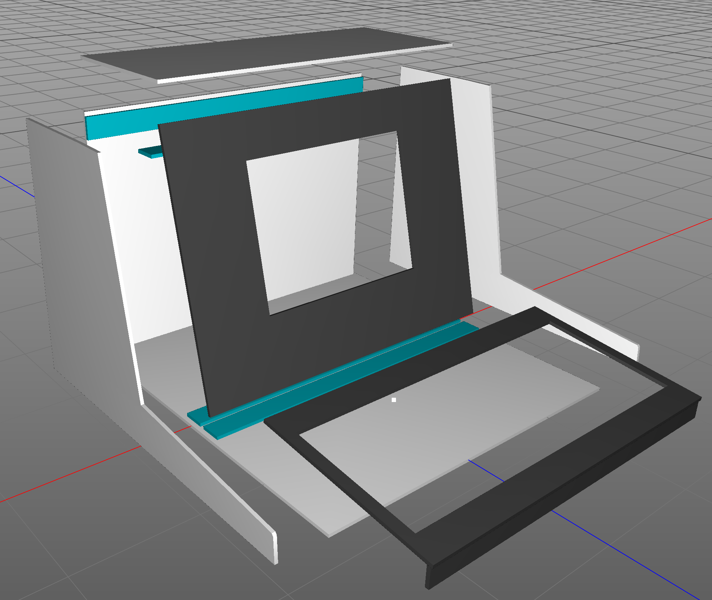
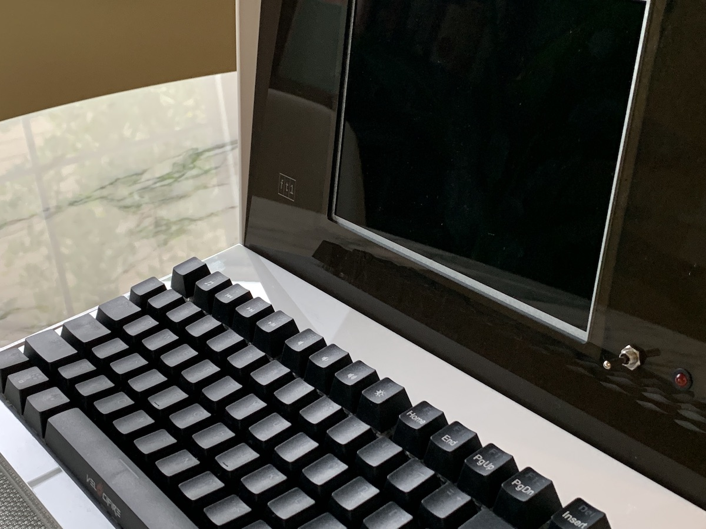
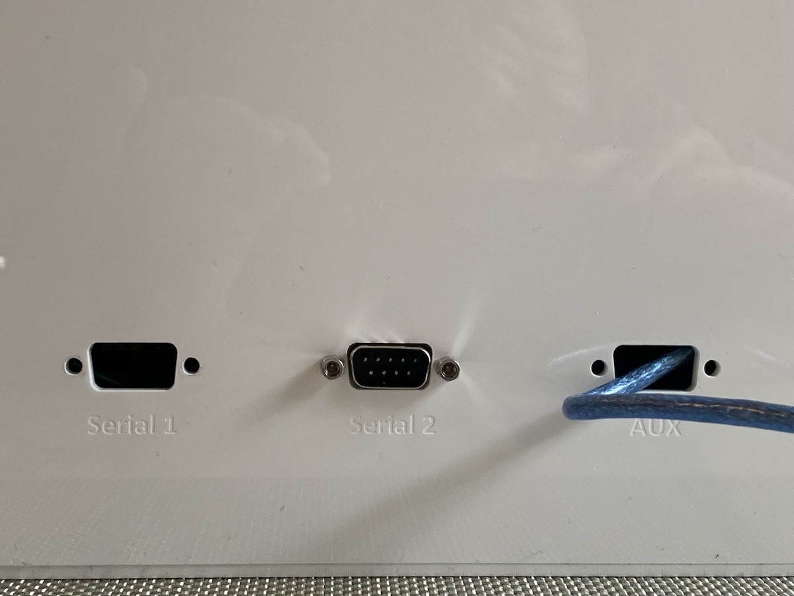

# FT1 - A retro-styled terminal

## Description

This is a brief description of how to build a retro-styled terminal, using a USB keyboard and a Raspberry Pi with serial adapter. This is a possible solution if you need a dedicated display for a retro-computer kit (for example, an [Altair-Arduino](https://www.altairduino.com) or [RC2014](https://rc2014.co.uk)).

Rather than 3D print the pieces, I designed them to be cut out of acrylic using a laser cutter. When cemeted together, this produces a solid unit that can withstand an 11-year-old playing Zork.

If you don't have access to a laser cutter, it's possible to submit plans online and get pieces in return from mail-order companies. If you have a branch of company such as TAP Plastics nearby, go in and have a chat to see what they can do for you. 

Note: Please triple-check the panels are exactly as you want them to be. It can get expensive to keep re-cutting acrylic if a mistake is made. Don't trust my plans over your own common sense!

## List of parts

* Enough acrylic sheets to cut out the required shapes. I used 3mm acrylic in white and semi-opaque black. Check out the left-over scraps box in your local plastics supply store.
* An LCD screen with HDMI input, preferably with a 4:3 display ratio, [such as this one from Amazon](https://www.amazon.com/gp/product/B01FHDL1DE).
* A nice clicky keyboard, such as [this one from Amazon](https://www.amazon.com/gp/product/B071W16NVZ). The keys lights up, but they can be turned off for a period feel.
* A Raspberry Pi. You can take the simple route and use a Pi Zero with the [PigFX](https://github.com/fbergama/pigfx) terminal emulator and a [Serial Hat](https://thepihut.com/products/serial-pizero?variant=26469111240), or you can go more advanced way by using a Pi 3 running [Cool-Retro-Term](https://github.com/Swordfish90/cool-retro-term) and a [USB-Serial adaptor](https://thepihut.com/products/adafruit-usb-serial-converter-ft232rl). Or some combination.

A set of cutting guides is included in this repo, but you **must** make sure they match the keyboard and screen you are going to use. The guides are in Visio format, as this is the format the cutter I used - a Helix - likes best. 

If you have a 3D modeling program, use the 3D model data in this repo to get a good idea of how the pieces will fit together (feel free to improve upon them!)

Note: I assembled my acrylic using acrylic cement, leaving the screen panel and lid unattached. They remain in place fine with friction, allowing me to work in the enclosure as required. You might want to avoid the cement, and use either hot glue (in which case you can use small pieces of wood to provide the 90' angles) or re-design to use  nuts and bolts.

The choice of acrylics is completely up to you. I used 3mm glossy opaque white for the outer shell, and for the screen panel I requested a glossy, opaque black. As it turned out, I was given a translucent dark piece for the screen by mistake. I tried it as-is, but the components of the screen and all the wires were easily visible, and so I spray painted the inside surface with a blue color paint over a primer coat. This created a wonderful rich retro-brown color that was totally unexpected and looked better than I could have planned.

The advantage to laser cutting is the ability to quickly make accurate DB9 socket holes, but also means you can engrave labels (both on the back panel and the screen panel). As you can see in the photograph, an extra frame is required around the screen to hide the metal of the LCD and visible glue.

## Instructions

* Assemble your Raspberry Pi serial solution.
* Confirm that the keyboard and screen work with the Raspberry Pi, and the retro computer to which you are connecting it.
* Disassemble the monitor to the bare screen and circuit board. Measure it carefully and confirm that the hole in the screen panel will be cut to the correct size. 
* Measure the keyboard carefully, and confirm the hole in the keyboard panel is the correct size. Allow for key travel on all four edges! Confirm the height of the keyboard lip piece is correct.
* Get the acrylic cut to size.
* Build the external frame first: attach a side, and back to the base. Then attach the other side. Do not attach the lid. The sides and back all sit on the base plate.
* Attach the two screen supports to the base, and the piece between the side panels in a location that allows the screen to angle back and rest on them (shown in blue in the render). The screen panel is a little taller than the sides, so can angle back just until it's 3mm lower than the sides. The lid will rest on it.
* Attach the rear lid support piece (shown in blue in the render) 3mm lower than the top of the sides.
* Attach the keyboard lip to the keyboard frame.
* Using hot glue, attach the LCD panel to the panel, lining up the screen as well as you can. You may also need an extra frame of acrylic to go around the screen and hide the glue used to hold the screen in place (included on Panel 7, see below).
* Using more hot glue, mount the keyboard in the right location. I used enough to hold the keyboard steady, not enough to ensure it would never ever be separated again short of using a hammer, just in case I needed to adjust it later.
* Attach any DB9 sockets, LEDs and Switches to the Raspberry Pi, and mount them using the holes cut in the case. Stuff all the electronics in the space behind the screen. I actually mounted all the electronics to a separate piece of acrylic that I could lower into place. If you are using a single Pi Zero, that is probably overkill.
* Attach the keyboard frame, checking one more time the keys are in the right position. The lip would be glued, the sides glued, and the back would rest on the keyboard. To be honest, once the keyboard is hot-glued I just left the keyboard frame un-glued, and friction held it in place.

Note: Not present in the render is the hole required for the keyboard's USB cable to pass through the screen. Nor or there any holes for LEDs, switches, power and serial connections. Some are present in the Viso documements - adjust them to suit your needs.

## Hints and tips

* Although the screen is described as having an aspect ratio of 4:3 you should NOT switch this model to the 4:3 mode on the internal on-screen menus. This seems to hang the display and is tricky to disengage (you need to find another video source to allow the on-screen menu to appear)

* The LCD screen has a USB port, and this seems adequate for running a Raspberry Pi zero. No need for an extra power supply!

* The screen has poor viewing angles. Set the brightness, contrast, and saturation to max for the clearest possible view.

* I added an LED and a switch on the front panel. The LED is connected to the Raspberry Pi's 5v and Gnd pins (with a 333 Ohm resistor). The switch is connected to the Pi's "RUN" connection on the board next to the main GPIO pins. When these pins are shorted, the Pi restarts. This can be handy from time to time.

* The other pole of the switch I added to an Ardunio Mega's reset switch. I installed the Mega in the enclosure in order to use it with [FizzTerm](https://github.com/GrantMeStrength/FizzTerm). This allows me to save and load programs, and experiment with writing my own terminal emulation firmware. In this case, the serial port on the outside of the terminal is connected to the Mega, and then from the Mega to the Raspberry Pi.

* There may be space in the enclosure to house a RC2014 as-is. If not, extended all the panels back about 10com will provide enough space to house almost anything you might want to hide back there.

* How you arrange the patterns on the sheets of acrylic to be cut is up to you, as it depends on the size the laser cutter supports.

* If you don't trust yourself with acrylics, you can definitely make a pretty decent version using foam-board and hot glue. Foam-board is a little thicker than 3mm, so take that into account when cutting the base and other pieces.

## Panel files

The Visio files are contain the panels as follows. Please check them before ordering or cutting. 

Note: The Helix cutter that I used requires a line drawing size of 0.01 pts in order to cut, and anything else to etch.

* Panel 1 - suggested color: glossy opaque white, or off-white.

The keyboard frame, keyboard lip, strips for holding the screen in place, and supporting the lid.

* Panel 2 - suggested color: glossy opaque white, or off-white.

Side panels.

* Panel 3 - suggested color: glossy opaque white, or off-white.

Baseplate.

* Panel 4 - suggested color: glossy opaque white, or off-white.

Backplate.

* Panel 5 - suggested color: glossy opaque white, or off-white.

Lid

* Panel 6 - suggested color: semi-transparent, painted on hidden side (or black opaque.)

Screen 

* Panel 7 - suggested color: black opaque

Screen frame

